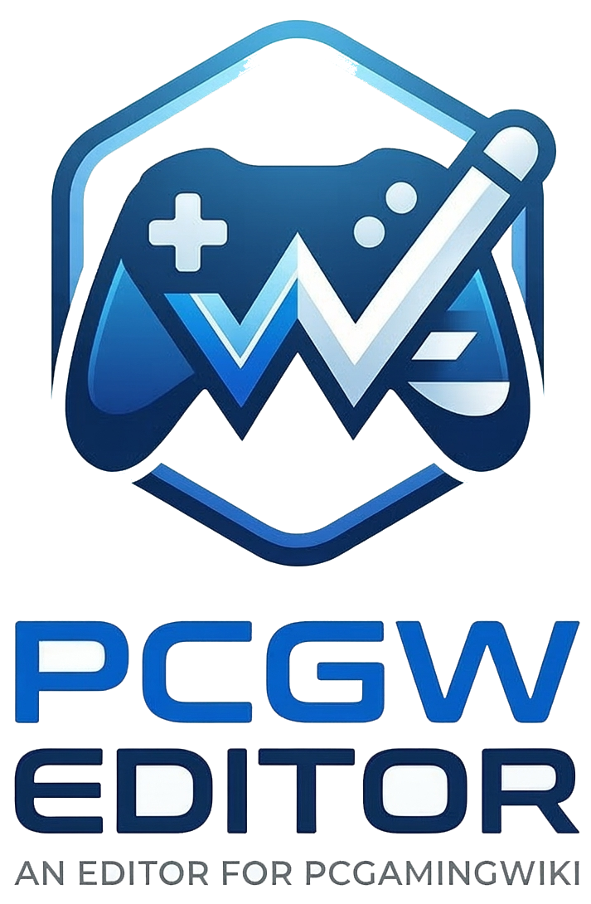

<p align="center">
  
</p>

# PCGamingWiki Editor


[](https://pcgw-editor.vercel.app/)

A modern, high-performance visual editor for PCGamingWiki. Transform wikitext editing into a sleek, real-time experience.

<div align="center">
  <a href="http://pcgwe.maicol07.it/">
    
  </a>
  &nbsp;&nbsp;&nbsp;&nbsp;
  <a href="https://pcgw-editor.vercel.app/">
    
  </a>
</div>


## 🧠 Development Philosophy

This project is a curated collaboration between a human developer and AI assistance—a practical demonstration of **semi-vibecoding**. 

Unlike fully AI-generated "slop" projects, this is a thoughtfully designed, maintainer-controlled codebase. AI is leveraged solely to accelerate development velocity, while core engineering decisions, code reviews, security auditing, and quality assurance are strictly driven by the maintainer.
### The Workflow:
-   **Velocity via AI**: Generative AI (leveraging models like **Google Gemini 3.5 Flash**, **Google Gemini 3 Pro / Flash**, and **Claude 4.5 Sonnet**, **Claude Opus 4.8** via the [Antigravity IDE](https://antigravity.google/product/antigravity-ide)) and [Claude Code](https://claude.com/product/claude-code) is used to bypass boilerplate, generate complex wikitext parser components, and speed up routine implementations.
-   **Rigorous Human Oversight**: Every single line of code generated by AI is carefully reviewed, refactored, and verified by an experienced developer before merging.
-   **Verification & Safety**: Automated unit tests and continuous manual verification ensure correctness, reliability, and security.

---

## 🌐 Environments

We maintain two versions of the editor to balance rapid testing with stability:

-   **Bleeding Edge (Development)**: [pcgw-editor.vercel.app](https://pcgw-editor.vercel.app/)
    -   Deployed automatically from the `main` branch.
    -   Contains the latest updates and experimental features. Might occasionally contain bugs.
-   **Stable (Production)**: [pcgwe.maicol07.it](http://pcgwe.maicol07.it/)
    -   The stable production release.
    -   Updated only after changes are validated in real-world usage on the bleeding-edge instance (e.g., during active wikitext editing workflows).

---

## 🚀 Key Features

### 🖥️ Modern Interface
-   **Split-Pane Editing**: Real-time visual feedback with a dedicated preview pane.
-   **Dark Mode Native**: Designed for comfort during late-night editing sessions.
-   **Visual & Code Modes**: Seamlessly switch between intuitive forms and raw wikitext tailored for power users.

### 🧠 Intelligent Analysis
-   **AI Screenshot Analysis**: Paste a screenshot of game video settings, and let our Gemini-powered engine automatically extract and populate the configuration fields. No more manual data entry.

### ⚡ Performance & Usability
-   **Virtual Scrolling**: Effortlessly handle large lists of workspaces and pages without UI lag.
-   **Floating Table of Contents**: Navigate long articles instantly with the new, responsive floating legend in the preview pane.
-   **Auto-Save**: Your work is persisted locally in real-time. Never lose an edit again.

### 🔧 Advanced Tooling
-   **Refined Input System**: Comprehensive support for detailed peripheral configurations including Arcade Sticks, Flight Sticks, and Racing Wheels.
-   **Wikitext Parsing**: Robust bidirectional transformation between wikitext and JSON models.

---

## 🛠️ Tech Stack

Built on the bleeding edge of web technology:

-   **Framework**: [Vue 3](https://vuejs.org/) (Composition API)
-   **Build Tool**: [Vite](https://vitejs.dev/)
-   **Styling**: [Tailwind CSS 4](https://tailwindcss.com/) & [PrimeVue 4](https://primevue.org/)
-   **State Management**: [Pinia](https://pinia.vuejs.org/)
-   **Language**: [TypeScript](https://www.typescriptlang.org/)
-   **Utilities**: [VueUse](https://vueuse.org/), [Wikitext Parser](https://github.com/maicol07/wikiparser-node)

---

## 🏁 Getting Started

### Prerequisites
-   Node.js 20+
-   pnpm 9+

### Installation

```bash
git clone https://github.com/maicol07/pcgw_editor.git
cd pcgw_editor
pnpm install
```

### Development

```bash
pnpm run dev
```

### Production Build

```bash
pnpm run build
```

---

## ☁️ Backend Proxy (Cloudflare Worker)

Authenticated PCGamingWiki requests, image proxying, and third-party metadata
lookups (IGDB / RAWG / Steam / VNDB) go through a Cloudflare Worker. Its source
is [`worker.js`](worker.js) in this repo and is deployed **separately** from the
frontend.

### Deploy

```bash
npm i -g wrangler      # once
wrangler login         # once
wrangler deploy worker.js --name pcgw-proxy-login
```

Endpoints: `/api/login`, `/api/proxy`, `/api/image`, and `/api/ext` — an
**allowlisted** proxy for IGDB/RAWG/Steam/VNDB that replaces the public
`corsproxy.io` (so user-supplied API keys are no longer exposed to a third
party). No per-environment configuration is required; CORS is open on these
endpoints, so the same Worker serves localhost, Vercel, and GitHub Pages.

### Optional: `HttpOnly` session cookies

By default the MediaWiki session is returned to the client and kept in
`localStorage`. To instead store it in a server-side `HttpOnly` cookie
(defense-in-depth against XSS), enable it on **both** sides — they must match,
or login breaks:

1. **Worker** env var with every app origin (scheme + host, no trailing slash):
   ```
   ALLOWED_ORIGINS=https://pcgwe.maicol07.it,https://pcgw-editor.vercel.app,http://localhost:5173
   ```
2. **Frontend** build flag: `VITE_HTTPONLY_AUTH=true` (Vercel/GitHub env var, or `.env.local`).

This needs HTTPS on every origin (cross-site cookies require `SameSite=None; Secure`).
Left unset, the default flow runs unchanged.

---

## 🔑 Third-Party API Credentials

To enable metadata autofill features, you can configure RAWG and IGDB API credentials in the **Integrations & APIs** tab within the App Settings (stored locally in your browser).

### RAWG API Key
RAWG is used to fetch game release dates, developers, publishers, and store links.
1. Visit the [RAWG.io API Docs](https://rawg.io/apidocs).
2. Log in or create a RAWG account.
3. Request an API key by completing the form. The key is typically issued immediately.
4. Copy the key and paste it into the **RAWG API Key** field in the app settings.

### IGDB / Twitch API Credentials
IGDB (Internet Game Database) is used to query ratings, genres, and store platform URLs. IGDB requires Twitch developer credentials.
1. Log in to the [Twitch Developer Console](https://dev.twitch.tv/console) using your Twitch account (Two-Factor Authentication must be enabled on your Twitch account).
2. Click **Register Your Application**.
3. Fill in the application details:
   - **Name**: Choose a unique name (e.g., `PCGamingWiki Editor`).
   - **OAuth Redirect URLs**: Use `http://localhost` (or any valid URL, since we do not redirect users for authentication).
   - **Category**: Select `Application Integration` or `Other`.
4. Click **Create**.
5. Locate your registered application, click **Manage**, and copy the **Client ID**.
6. Click **New Secret** to generate a client secret, and copy the **Client Secret** immediately (it will only be displayed once).
7. Paste these credentials into the **Client ID** and **Client Secret** fields in the Twitch IGDB Integration settings.

---

## 🤝 Contributing

Contributions are welcome! Whether it's a bug fix, a new feature, or a design improvement, feel free to open a Pull Request.

## 📄 License

This project is open-source and available under the MIT License.
